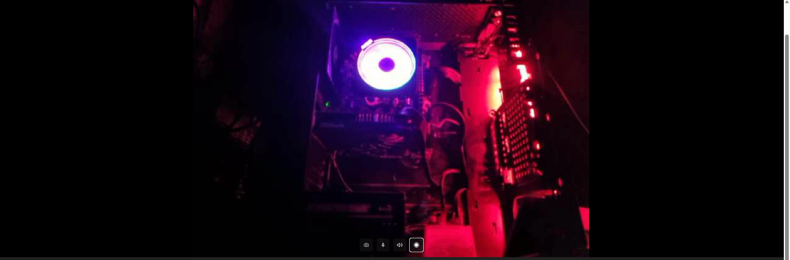

# Webcam using React

## Description

This is a basoc camera "component" built in React that includes features such as:

- Starting and stopping the camera
- Muting and unmuting the microphone
- Automatic capture of snapshots
- Manual capture of snapshots
- Zoom in and out 
- Video recording
- Switching between available cameras

The app utilizes several custom hooks (`"useCaptureImage"`, `useRecording`) and utility functions (`cameraActions`) to achieve its functionality. 

## Table of Contents

1. [Installation](#installation)
2. [Usage](#usage)
3. [Screenshots](#screenshots)

## Installation

```bash
# Install via npm
npm install <package-name>

npm install --save react-medium-image-zoom

```

## Usage

```bash
# Run the app
npm start

```

## Screenshots

### Main Interface



### Features

#### Camera Off


#### Automatic Capture


#### Manual Capture


#### Select Camera


#### Video Recording


